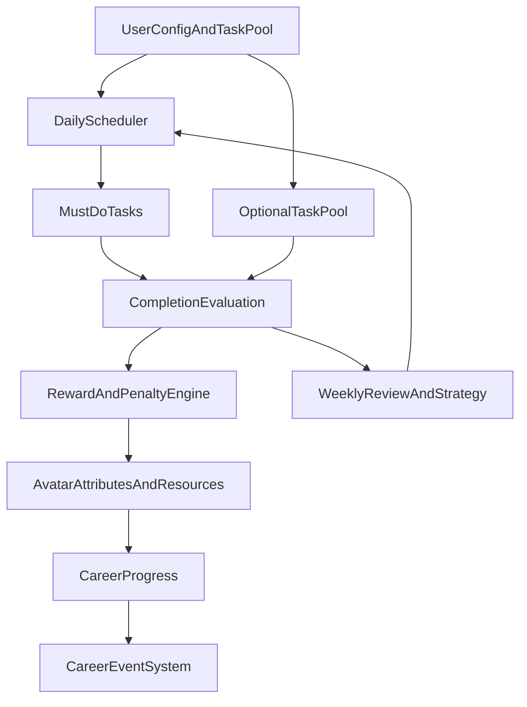

# 自我成长游戏软件需求规格说明书（本地自用版）

## 1. 文档范围与目标
- 本文档仅定义软件需求，不包含 UI 原型、技术架构实现细节、数据库实现脚本或开发排期。
- 产品目标是将“自我成长”转化为可持续执行、可量化反馈、可模拟生涯进展的游戏化体验。
- 适用场景为本地自用、单用户、长期每日使用。

## 2. 产品定位
- 核心体验：
  - 用户定义成长目标与任务池。
  - 系统每日下发“必做任务”（高奖励、高权重）。
  - 用户可主动执行“额外任务”（低奖励、辅助成长）。
  - 用户通过资源兑换现实奖励，形成可感知的趣味消费驱动。
  - 角色属性、生涯路径、事件系统共同构成“生涯模拟”闭环。

## 3. 用户与角色模型
### 3.1 用户对象
- 单一用户（产品所有者本人）。

### 3.2 角色（Avatar）要素
- 基础属性：自律、执行力、专注、体能、情绪稳定、专业能力。
- 资源值：经验（EXP）、金币（Coin）、精力（Energy）、信誉（Reputation，可选）。
- 生涯状态：三条阶段（探索期 / 进阶期 / 冲刺期）× 每阶段 6 档现实向职称、按自然月晋升、职业分支与里程碑进度。

## 4. 核心业务目标与成功标准
### 4.1 业务目标
- 提升每日任务完成率。
- 提升“关键缺点改进任务”的连续完成天数。
- 建立稳定的周复盘节奏。

### 4.2 量化成功标准
- 7 日必做任务完成率 >= 80%。
- 针对性改善任务连续达成 >= 14 天。
- 每周至少完成 1 次复盘并输出下周改进策略。

## 5. 功能需求（Functional Requirements）
### FR-1 目标与任务定义
- 系统应支持创建成长目标，至少包含：
  - 目标类型：职业发展 / 习惯养成。
  - 难度、优先级、预估时长、执行周期。
  - 缺点标签（如拖延、分心、回避沟通）。
- 系统应支持维护任务模板库：**必做候选（主线）模板**带标题与详情字段；**不再**维护系统「额外任务池」模板，其它完成事项见 FR-3「自填完成事项」。

### FR-2 每日必做任务下发
- 系统应在每日固定时间自动生成并下发当日必做任务。
- 下发规则应满足：
  - 至少包含 1 项“缺点针对性改善任务”。
  - 职业发展与习惯养成按可配置比例分配（默认 6:4）。
  - 根据历史完成情况动态调整难度（连续失败降阶，连续成功升阶）。
- 必做任务应具有：
  - 更高 EXP/Coin 奖励权重。
  - 逾期惩罚机制（资源扣减或连胜中断）。
- **主线任务详情**：每条主线模板应带「建议做法」「意义说明」等结构化文案；前端提供**详情页/弹层**展示，帮助用户理解任务之间的递进关系与执行方式。

### FR-3 自填完成事项（替代系统选做池）
- 系统**不再**从模板池自动下发「选做/额外」任务。
- 用户应可随时以**自由文本**描述「今天实际做过的、但不在主线列表里的事」，提交后系统调用 **API（大模型或启发式）** 评估 **难度 1–3** 与建议代币，并写入**当日已完成任务**（`self_report`），其难度点**计入当日工作量进度**与周生涯统计；奖励系数默认低于主线必做。
- 自填记录不计入「主线必做连胜」与「月度职称复杂分」，但计入总成长与周难度点累计。

### FR-4 完成判定与证据记录
- 系统应支持以下完成模式：
  - 手动打卡。
  - 结构化记录（时长、产出、反思）。
  - 证据附件（截图/文本摘要，可选）。
- 完成质量评分应由以下部分构成：
  - 基础完成分。
  - 质量分。
  - 连续性加成分。

### FR-5 激励与反馈
- 完成任务后应即时反馈：
  - 属性变化。
  - 资源变化。
  - 连续状态变化。
- 系统应提供中期反馈：
  - 日报（完成/未完成/原因）。
  - 周报（趋势、薄弱项、下周建议）。
- 系统应支持成就机制：
  - 连续完成成就。
  - 专项提升成就。
  - 生涯里程碑成就。
- 系统应支持资源消费玩法（核心驱动）：
  - 资源可用于购买游戏道具（如任务跳过券、双倍加成卡、补签卡、随机增益卡）。
  - 资源可用于兑换现实奖励（如饮品、餐食升级、休闲娱乐时段、小额购物）。
  - 兑换应设置多档位与冷却机制，确保“有趣且不过度消费”。

### FR-6 生涯模拟机制
- 系统应支持“周职业角色扮演模式”：
  - 用户每周选择 1 个职业角色作为当周主线。
  - 系统当周必做任务应按该职业的人类需要导向自动生成。
  - 周中允许 1 次改职（有资源成本或收益折损）。
- **职称与阶段（与周职业正交、按自然月结算）**：
  - 每条周职业（如医生、工程师、教练等）在数据上对应一条**独立职称轨**，共 **3 条生涯阶段 × 每阶段 6 档职称**（需求上为每阶段 5–6 档梯度，本实现取 **6** 档；合计 18 级），职称名称应贴近现实岗位梯度（见种子数据 `careerTitles` / `CareerNode`）。
  - **晋升周期为自然月**：每个自然月结束时（或用户数据在次月首次被访问时触发结算），系统根据**当月累计「复杂分」**判定是否晋升一档职称。
  - **复杂分定义**：仅统计用户**已完成**的、**主线必做**（`mandatory` + `isMainline`）任务；每条贡献 **难度²** 分（难度 1→1 分，2→4 分，3→9 分），与「任务难度点」体系一致取向。
  - **晋升门槛**：门槛与用户的「每日目标工作量（难度点）」及当前阶段/档位正相关（公式实现于 `monthlyPromotionThreshold`），体现「当前任务点规模下完成较复杂工作」才可晋升。
  - **失去机会**：若某自然月结算时未达到该月门槛，则**该月不晋升**（职称不变），不累计到次月；次月重新从 0 累计复杂分并再次判定。
  - **已达最高档**：第 3 阶段第 6 档封顶后不再晋升，仅保留周挑战与代币等其它反馈。
- **任务难度与职称阶段挂钩**：
  - 每日调度在抽取模板时，应根据用户**在当前周职业上的职称阶段**，优先从与该阶段匹配的**模板基础难度区间**中抽取主线与选做任务，并对最终下发难度叠加合理系数，避免「探索期」与「冲刺期」长期接到同一难度谱系的任务组合。
- 系统应支持事件机制：
  - 正向事件：满足条件后触发机会、奖励或新技能槽（含晋升成功等可审计记录）。
  - 风险事件：长期低完成触发压力、资源损耗、难度重平衡。
- 生涯进展应由以下变量共同驱动：
  - 专业任务完成率。
  - 习惯稳定性。
  - 缺点改善指数。
  - **月度主线复杂分**（职称晋升）。

### FR-7 周复盘与策略迭代
- 系统应每周自动生成问题清单，包括：
  - 失败频次最高任务。
  - 最易中断时段。
  - 缺点反复模式。
- 用户应可配置下周策略：
  - 选择下周职业角色（决定任务主线与奖励倾向）。
  - 增减任务类型配额。
  - 调整每日下发时间。
  - 选择最多 2 个重点缺点专项改善。

### FR-8 本地化配置与数据导出
- 所有业务数据默认存储于本地。
- 系统应支持配置：
  - 任务下发时间。
  - 奖励倍率。
  - 惩罚强度。
  - 难度曲线。
- 系统应支持导出 JSON/CSV 用于备份与长期复盘。

## 6. 规则引擎需求（奖励与约束）
### 6.1 规则目标
- 必做任务：高收益、强约束，塑造主线成长。
- 额外任务：低收益、高灵活，鼓励自主探索。
- 资源消费：高趣味、可兑现，作为持续执行核心驱动力。

### 6.2 奖励公式（需求基线）
- 必做奖励 = 基础值 x 难度系数 x 质量系数 x 连续系数
- 额外奖励 = 必做同级奖励 x 折扣系数

### 6.3 MVP 参数基线（可配置）
- 额外任务折扣系数：0.3 ~ 0.6（默认 0.5）。
- 必做任务逾期惩罚：扣减当次基准奖励的 20% ~ 40%（默认 30%）。
- 连续加成上限：最多叠加至基础值的 1.5 倍（默认封顶 1.5）。
- 同类低价值任务收益递减：
  - 第 1 次 100%
  - 第 2 次 70%
  - 第 3 次及以后 40%

### 6.4 防刷与平衡
- 超短时重复任务应设置每日收益上限。
- 同类型任务连续刷取应触发奖励衰减。
- 规则应保证“主线（必做）收益显著高于支线（额外）”。
- 现实奖励兑换应受“预算护栏”限制，不得突破用户预设日支出上限。

### 6.5 现实奖励兑换经济（基于日预算 250 元）
- 系统应支持按现实预算自动生成兑换档位（默认按 250 元/日）：
  - S 档（20 元内）：低门槛高频奖励，如饮品、小零食、短视频放松 20 分钟。
  - A 档（20-50 元）：中频奖励，如轻食加餐、咖啡升级、1 小时娱乐时段。
  - B 档（50-100 元）：低频奖励，如电影/桌游、运动馆单次体验。
  - C 档（100-180 元）：稀有奖励，如高质量正餐、兴趣活动单次消费。
  - X 档（180-250 元）：周里程碑奖励，需满足高连续完成门槛。
- 兑换约束：
  - 单日现实兑换累计不得超过 250 元。
  - 同档位在日内有次数限制（默认 S<=3, A<=2, B<=1, C<=1, X<=0）。
  - X 档仅周末开放，且当周必做完成率 >= 85%。
- 资源与金额映射应可配置，默认建议：
  - 1 元现实预算 ~= 10 Coin 消耗（用于兑换计算，不等于真实货币支付接口）。
  - 必做任务产币效率显著高于额外任务（同难度至少 1.8 倍）。

## 7. 职业角色设计（基于现实人类需要）
### 7.1 设计原则
- 职业应映射人类核心需要：生理健康、安全秩序、关系联结、成长成就、自我实现。
- 每个职业必须同时产出三类报酬：
  - 游戏报酬：EXP/Coin/属性提升。
  - 现实报酬：可兑换奖励资格提升或兑换折扣。
  - 生涯报酬：解锁职业专属事件与长期里程碑。

### 7.2 职业池（MVP 必备）
- 医生（健康维护者）：主线关注身体健康与心理健康。
  - 任务倾向：睡眠、运动、饮食记录、情绪日志、正念训练。
  - 报酬倾向：体能/情绪稳定属性增益更高。
- 工程师（系统构建者）：主线关注专注学习与问题解决。
  - 任务倾向：高强度深度学习、错题复盘、知识结构化输出。
  - 报酬倾向：专业能力/执行力增益更高。
- 教练（习惯塑形者）：主线关注纪律与稳定执行。
  - 任务倾向：晨起仪式、时间块执行、行为复盘、拖延矫正。
  - 报酬倾向：自律/专注增益更高。
- 研究员（认知升级者）：主线关注理解深度与方法优化。
  - 任务倾向：文献阅读、概念对比、阶段性复述、策略实验。
  - 报酬倾向：专业能力/反思质量加成更高。

### 7.3 针对用户画像的默认职业编排
- 用户画像：软件工程大三，目标为 2026 年 12 月考研，日可支出约 250 元。
- 系统默认周循环建议：
  - 周一至周三：工程师（学习主线冲刺）。
  - 周四：研究员（方法与薄弱点修正）。
  - 周五：教练（执行系统修复与节奏重建）。
  - 周末二选一：医生（身心恢复）或工程师（阶段冲刺）。
- 若连续 3 天睡眠或情绪指标不达标，系统应强制推荐切换至医生职业周。

### 7.4 考研专用职业-任务-奖励映射（MVP 配置基线）
- 说明：以下为需求层的默认配置模板，后续可在产品中参数化调整。

#### 7.4.1 医生（健康维护者）任务池
- 任务模板（示例 20 条）：
  - 睡眠满 7.5 小时；23:30 前入睡；晨起 10 分钟拉伸；快走 30 分钟；力量训练 20 分钟。
  - 三餐定时并记录；减少含糖饮料；补水达标；午休 20 分钟；晚间放松训练。
  - 番茄钟间隙眼保健；颈肩放松；屏幕外活动 30 分钟；睡前不刷短视频 30 分钟。
  - 情绪温度计打分；写 100 字情绪日志；5 分钟呼吸训练；负面事件 ABC 复盘；一次主动求助沟通。
- 奖励权重建议：
  - 体能 +1.3x；情绪稳定 +1.4x；专注 +1.1x；Coin +1.0x。

#### 7.4.2 工程师（系统构建者）任务池
- 任务模板（示例 20 条）：
  - 数学专题训练 90 分钟；英语阅读 1 篇精读；专业课章节学习 2 小时；算法题 3 题。
  - 错题重做 10 题；知识点卡片整理 15 条；真题限时模块训练；代码实现经典算法。
  - 一次 120 分钟深度学习；学习中断次数 <= 3；当天学习计划完成率 >= 85%。
  - 1 次模拟考试；考试后复盘报告；第二天纠错清单执行；薄弱点清单更新。
  - 一周总结输出 500 字；向未来自己解释 1 个难点；复述一章核心框架。
- 奖励权重建议：
  - 专业能力 +1.5x；执行力 +1.3x；专注 +1.2x；Coin +1.2x。

#### 7.4.3 教练（习惯塑形者）任务池
- 任务模板（示例 20 条）：
  - 早起固定时刻；晨间计划 10 分钟；当日三件最重要任务（MIT）锁定。
  - 时间块执行 4 组；手机隔离 2 小时；番茄钟 8 组；拖延任务先做 1 项。
  - 晚间复盘（完成/偏差/原因）；明日计划预排；干扰源记录；执行阻力记录。
  - 零碎任务批处理；任务拆分到 30 分钟粒度；中断后 5 分钟重启机制。
  - 一天仅 2 次社媒窗口；冲动消费记录；非计划娱乐时长控制。
- 奖励权重建议：
  - 自律 +1.5x；执行力 +1.4x；专注 +1.2x；Coin +1.1x。

#### 7.4.4 研究员（认知升级者）任务池
- 任务模板（示例 20 条）：
  - 阅读 1 篇高质量经验贴并提炼；做 1 次方法对比实验；整理错因 taxonomy。
  - 对同一知识点写两种解释；构建思维导图；阶段性复述 10 分钟录音。
  - 周目标与日行为一致性检查；学习策略 A/B 测试；预测-结果偏差分析。
  - 输出 1 份周策略报告；提炼 3 条高杠杆行为；淘汰 1 条低收益习惯。
  - 复盘失败任务链路（触发-行为-结果）；重写任务定义；调整难度曲线。
- 奖励权重建议：
  - 专业能力 +1.3x；情绪稳定 +1.2x；执行力 +1.1x；Coin +1.0x。

## 8. 任务未完成的拟真后果系统（负反馈机制）
### 8.1 设计原则
- 后果必须贴近现实生活成本，不采用夸张或纯惩罚式设计。
- 负反馈应以“损失真实机会”为主，而非单纯数值清零。
- 惩罚应可恢复，但恢复需要额外行动成本，形成行为约束。

### 8.2 日级后果（当天未完成）
- 必做任务未完成应触发：
  - 当日 Coin 结算扣减（默认 -20% 到 -40% 基准产出）。
  - 当日现实奖励兑换额度下调（默认下调 20%）。
  - 连续加成中断或降档（如 5 连 -> 2 连）。
  - 次日首个时段自动插入“补救任务”（如错题回补、睡眠修复）。
- 额外任务未完成：
  - 不触发主线惩罚，但触发轻微信誉下降（影响事件触发概率）。

### 8.3 周级后果（累计偏差）
- 一周必做完成率 < 70% 时：
  - 取消 X 档奖励兑换资格 1 周。
  - **月度职称晋升冻结（语义）**：后果规则中可标记 `freezeCareerLevelUp`，产品层应解释为**禁止或推迟该用户在下一自然月的自动职称晋升判定**（与「周」解耦，避免与按月晋升冲突）。
  - 风险事件概率提高（如“精力赤字周”“复习进度滞后”）。
- 一周必做完成率 < 50% 时：
  - 下周强制进入“恢复周策略”（医生/教练优先）。
  - 高难任务比例自动下降，补救任务比例上升。

### 8.4 拟真事件示例
- 睡眠连续不达标 3 天：
  - 虚拟后果：精力上限 -15%，专注收益系数 -10%（持续 2 天）。
  - 现实映射：学习效率下降，需先完成睡眠修复任务才能恢复。
- 学习主线连续未达成 2 天：
  - 虚拟后果：职业主线报酬衰减，里程碑进度暂停。
  - 现实映射：阶段目标推迟，周末需要额外补学时段。
- 情绪记录连续缺失 4 天：
  - 虚拟后果：风险事件触发率提升，随机干扰事件增加。
  - 现实映射：焦虑/拖延易上升，系统要求先做情绪稳定任务。

### 8.5 负反馈恢复机制（必须存在）
- 系统应提供“可恢复”闭环，避免挫败堆积：
  - 完成补救任务可逐步恢复属性与兑换额度。
  - 连续 3 天达标可解除大部分临时惩罚。
  - 周复盘中可申请一次“策略重置”，以降低下周崩盘风险。

## 9. 非功能需求（NFR）
- 可用性：核心流程（查看必做 -> 执行 -> 打卡反馈）不超过 3 步。
- 性能：本地日常交互响应 < 300ms。
- 可扩展性：任务类型、属性维度、事件模板可扩展。
- 可靠性：数据异常时支持自动恢复和最近备份回滚。
- 隐私安全：仅本地存储；未来若扩展云同步需补充加密与授权策略。

## 10. 数据模型（概念层）
### 10.1 核心实体
- Goal（成长目标）
- TaskTemplate（任务模板）
- DailyTask（当日任务实例）
- CompletionLog（完成记录）
- AttributeSnapshot（属性快照）
- CareerNode（生涯节点：每职业 18 档职称定义与文档性解锁规则）
- UserProfessionCareer（用户在某职业上的职称档位与当月复杂分进度）
- EventRecord（事件记录）
- ProfessionRole（周职业角色）
- RewardCatalog（奖励目录）
- RedemptionRecord（兑换记录）
- BudgetGuard（预算护栏配置）
- ConsequenceRule（后果规则）
- RecoveryPlan（恢复计划）

### 10.2 关系约束
- Goal 1:N TaskTemplate
- DailyTask N:1 TaskTemplate
- DailyTask 1:N CompletionLog（支持补充记录）
- CompletionLog 触发 AttributeSnapshot 与 EventRecord 更新
- ProfessionRole 1:N DailyTask（当周任务生成依据）
- RewardCatalog 1:N RedemptionRecord
- BudgetGuard 1:N RedemptionRecord（校验日预算上限）
- ConsequenceRule 1:N DailyTask（未完成触发）
- RecoveryPlan 1:N ConsequenceRule（恢复流程）

## 11. 验收标准（需求验收）
- 可创建并管理职业发展与习惯养成两类目标与任务模板。
- 每日可自动下发必做任务，且至少 1 项是缺点针对任务。
- 用户可主动领取额外任务，且奖励显著低于必做任务。
- 任务完成后可查看资源变化、属性变化与连续状态。
- 系统可在周维度生成复盘并支持下周策略调整。
- 生涯模拟进度随任务执行产生可解释变化。
- **月度职称**：可按自然月查看主线复杂分与晋升门槛；未达标时次月不追溯补晋升；达标时职称上调并有可审计事件记录。
- **难度分层**：同一周职业下，探索期与冲刺期调度出的任务模板基础难度分布可区分，不出现长期「初阶终阶同一谱系」的排班。
- 支持多档位现实奖励兑换，并受日预算 250 元护栏控制。
- 支持每周职业角色选择，并让任务结构随职业变化。
- 支持“未完成任务 -> 拟真后果 -> 可恢复补救”的完整负反馈闭环。
- 支持考研用户可直接启用职业-任务-奖励映射模板。

## 12. MVP 范围定义
### 12.1 必须包含
- 任务池管理。
- 每日必做下发。
- 额外任务执行。
- 基础奖励/惩罚机制。
- 现实奖励多档位兑换与预算护栏。
- 周职业角色扮演（至少 4 个职业）。
- 未完成任务的日级/周级后果与恢复任务机制。
- 考研场景默认职业-任务模板（4 职业 x 各 20 条任务示例）。
- 周复盘。
- 简化生涯节点系统。

### 12.2 暂不包含
- 复杂剧情分支。
- 社交系统。
- 多用户能力。
- 云同步。
- AI 自动评估。

## 13. 风险与约束
- 规则过多将导致维护成本上升。
- 奖励失衡可能诱导刷分而非真实成长。
- 惩罚过重可能造成放弃使用风险。
- 约束策略：优先采用少量可解释参数，以周为单位滚动校准。
- 惩罚策略约束：默认先限权（降兑换、降收益）再扣分，避免“一次失败全盘崩塌”。

## 14. 下一阶段建议（需求后续）
- 下一阶段可选项为“信息架构与交互原型设计”，用于把本需求转化为可操作页面流与关键交互。
- 建议先冻结以下需求参数再进入下一阶段：
  - 必做/额外奖励倍率与惩罚强度。
  - 奖励兑换金额档位与预算护栏阈值。
  - 职业池、职业切换成本与职业任务映射表。
  - 缺点标签体系与优先级规则。
  - 周复盘输出项（固定模板）。
- 若参数未冻结，应先完成一轮需求评审后再进入原型与实现环节。

## 15. 可执行参数基线表（MVP）
| 参数类别 | 参数名 | 默认值 | 可调范围 | 说明 |
|---|---:|---:|---:|---|
| 奖励 | 必做基础 Coin | 120 | 80-180 | 主线产出基准 |
| 奖励 | 额外基础 Coin | 60 | 30-100 | 同难度下低于必做 |
| 奖励 | 连续加成上限 | 1.5x | 1.2x-2.0x | 防止无限膨胀 |
| 惩罚 | 必做逾期扣减 | 30% | 20%-40% | 日级惩罚 |
| 惩罚 | 当日兑换额度下调 | 20% | 10%-40% | 未完成触发 |
| 惩罚 | 周完成率阈值1 | 70% | 60%-80% | 触发冻结高档兑换 |
| 惩罚 | 周完成率阈值2 | 50% | 40%-60% | 触发恢复周策略 |
| 恢复 | 连续恢复达标天数 | 3天 | 2-5天 | 解除临时惩罚 |
| 预算 | 日现实兑换上限 | 250元 | 100-400元 | 用户现实预算护栏 |
| 职业 | 周中改职次数 | 1次 | 0-2次 | 超限需额外成本 |

## 16. AI-NPC 对话系统需求
### 16.1 目标
- 用户与虚拟职业 NPC 对话时，系统应实时调用大模型生成拟真回复。
- 对话风格应与所选职业及当前状态一致（如医生更关注健康风险提醒、工程师更关注学习系统优化）。

### 16.2 功能需求
- 系统应提供 AI 接口层，至少支持：
  - 接收前端对话上下文与 NPC 角色信息。
  - 读取 NPC 描述文件（系统提示词）并拼接用户上下文。
  - 调用大模型并返回回复文本。
- 前端应提供 API Key 输入区域，用户输入后可直接发起对话请求。
- API Key 应仅保存在本地（浏览器本地存储），不写入仓库文件。

### 16.3 非功能与安全要求
- 对话响应目标：常规网络环境下首字延迟不超过 3 秒（非强约束）。
- 接口应校验空 key、空消息、超长输入等异常。
- 日志中不得明文打印用户 API Key。

### 16.4 验收标准补充
- 用户在前端填入可用 API Key 后，可与 NPC 连续对话不少于 3 轮。
- 切换职业后，NPC 回复风格可被用户明显感知差异。
- 清空或失效 key 时，前端能给出可理解错误提示。

