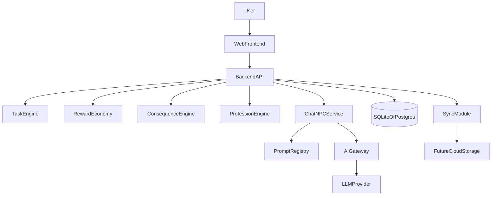

# 自我成长游戏软件架构设计（本地优先，可云扩展）

## 1. 架构目标与原则

- 本地优先：单机可完整运行核心流程（任务、奖励、惩罚、复盘、NPC 对话）。
- 云可扩展：不重写业务层即可迁移到云数据库与多设备同步。
- 模块解耦：任务引擎、奖励经济、后果系统、职业系统、AI 对话可独立演进。
- 可观测与可恢复：关键操作可审计，失败可降级，状态可恢复。

## 2. 总体分层

### 2.1 展示层（Frontend）

- 技术建议：React + TypeScript。
- 主要页面：
  - 仪表盘（当日状态总览）
  - 每日任务（必做/额外）
  - 奖励商店（道具/现实奖励兑换）
  - 职业周计划（角色扮演）
  - NPC 对话
  - 周复盘
- 职责边界：
  - 输入与展示，不承载核心业务规则。
  - 保存本地 UI 状态和 API Key（仅本机）。

### 2.2 应用层（Backend API）

- 技术建议：Node.js + TypeScript（首版可 Express，演进可 NestJS）。
- 统一前缀：`/api/v1/*`
- 模块划分：
  - `TaskEngine`
  - `RewardEconomy`
  - `ConsequenceEngine`
  - `ProfessionEngine`（周职业计划、周生涯分档奖励）
  - `CareerProgressService`（按自然月的职称轨、复杂分累计、月末晋升结算）
  - `ChatNPC`
  - `ReviewReport`
  - `Sync`
- 职责边界：
  - 编排用例、校验请求、调用领域服务、事务控制。

### 2.3 领域层（Domain）

- 核心聚合：
  - `UserProfile`
  - `TaskPlan`
  - `RewardWallet`
  - `ConsequenceState`
  - `ProfessionWeek`
  - `UserProfessionCareer`（每用户 × 每 `ProfessionRole` 一条：阶段、档内位、当月复杂分、跟踪月份）
  - `ConversationSession`
- 核心规则：
  - 必做任务下发策略
  - 奖励/惩罚与预算护栏
  - 周职业任务映射
  - **职称感知调度**：`DailyScheduler` 读取 `UserProfessionCareer`，按阶段映射模板基础难度区间，并与「周主线阶段 intro/execution/expert」叠加，使初阶与终阶任务谱系分离。
  - **月度晋升闭环**：任务完成事务后累加主线必做的「难度²」复杂分；仪表盘 / 任务首访触发 `rollMonthlyCareerIfNeeded`，按自然月结转并写 `EventRecord`（晋升成功或机会错失）。
  - 未完成后果与恢复闭环

### 2.4 基础设施层（Infrastructure）

- 存储：SQLite（本地）/ PostgreSQL（云）
- ORM：Prisma
- 能力组件：
  - Repository
  - Prompt Loader / Prompt Registry
  - AI Provider Adapter
  - Scheduler（每日下发、周复盘）
  - 审计日志
  - 导入导出与同步适配器

## 3. 前端架构

## 3.1 目录建议

- `src/app`：应用入口与路由
- `src/features/tasks`：任务流
- `src/features/rewards`：奖励兑换
- `src/features/professions`：周职业配置
- `src/features/chat`：NPC 对话
- `src/features/review`：周复盘
- `src/shared/api`：HTTP Client 与 DTO
- `src/shared/state`：全局状态

## 3.2 状态分层

- 服务器状态：任务列表、钱包、惩罚状态、周报（建议 React Query）。
- 本地状态：API Key、聊天输入草稿、UI 偏好（localStorage）。

## 3.3 关键交互

- 完成任务 -> 即时刷新奖励与后果状态卡片。
- 职业切换 -> 触发任务池切换与奖励权重变化展示。
- NPC 对话 -> 自动携带当前职业与当日状态摘要。

## 4. 后端架构与接口

## 4.1 核心 API（V1）

- `POST /api/v1/chat/npc`：NPC 对话
- `GET /api/v1/tasks/today`：获取今日任务
- `POST /api/v1/tasks/:id/complete`：任务打卡
- `POST /api/v1/tasks/self-activity`：自填完成事项（LLM/启发式估难度，写入当日已完成并结算代币）
- `POST /api/v1/rewards/redeem`：兑换奖励
- `GET /api/v1/consequences/current`：当前后果状态
- `POST /api/v1/professions/weekly-plan`：设置周职业
- `GET /api/v1/reports/weekly`：获取周复盘
- `GET /api/v1/dashboard/summary`：仪表盘（含 `weeklyCareer` 周挑战与 `monthlyCareer` 月度职称进度）

## 4.2 事务边界

- 任务完成事务：
  1. 写入完成记录
  2. 结算奖励
  3. 更新属性与钱包
  4. 更新后果状态（如恢复惩罚）
  5. 异步/后置：`UserProfessionCareer` 累加当月主线复杂分；`WeeklyProfessionPlan` 更新周主线阶段（与职称轨独立）
- 奖励兑换事务：
  1. 校验预算护栏
  2. 校验钱包余额
  3. 扣减 Coin
  4. 写入兑换记录

## 5. 数据库逻辑设计

- 见 [docs/database/logical_schema.sql](docs/database/logical_schema.sql)。
- 主实体：用户、目标、模板、日任务、日志、钱包、职业计划、兑换、后果、恢复、聊天、提示词、同步事件。

## 6. AI 接口架构

### 6.1 组件

- `AIGateway`：统一 AI 提供商调用协议
- `PromptRegistry`：角色 Prompt 版本管理（文件默认 + DB 覆盖）
- `ChatOrchestrator`：拼接上下文并发起请求
- `FallbackResponder`：故障时规则式回复

### 6.2 请求上下文组装

- 系统提示：职业角色定义 + 安全约束
- 用户画像：考研目标、预算护栏、近期状态
- 会话摘要：最近若干轮对话
- 运行时状态：今日任务完成率、当前惩罚状态

### 6.3 安全约束

- 不落盘明文 API Key
- 日志中脱敏 Key 与用户输入
- 记录 provider 状态码与耗时，便于故障诊断

### 6.4 降级策略

- `401/403`：提示 key 失效并引导重新输入
- 超时/5xx：返回规则式 NPC 回复（保证可用）
- 响应为空：返回安全兜底文案并提示重试

- 接口契约见 [docs/api/ai_gateway_contract.yaml](docs/api/ai_gateway_contract.yaml)。

## 7. 本地优先到云扩展路径

### Phase 1（本地 MVP）

- 单体部署：Web + API + SQLite
- 支持完整闭环：任务、奖励、后果、职业、NPC 对话

### Phase 2（可扩展准备）

- 模块化重构：明确 domain service 与 repository 边界
- 增加 sync 抽象层与审计日志
- 建立 SQLite -> PostgreSQL 迁移脚本

### Phase 3（云扩展）

- 引入账户系统与设备绑定
- PostgreSQL + 对象存储 + 同步队列
- AI 网关支持多模型路由与成本策略

## 8. 架构验收标准

- 单机离线可完成核心业务；联网可进行 NPC AI 对话。
- 任务结算、奖励兑换、惩罚恢复满足事务一致性。
- 更换 AI Provider 不影响前端接口。
- 迁移 PostgreSQL 不改变业务服务层接口。
- 同步模块关闭时，不影响本地核心功能使用。
